<p align="center">
  <h1 align="center">🌳 tree-shaker</h1>
  <p align="center">
    <strong>JSON tree shaking for Go</strong><br/>
    Keep what you need. Discard the rest.
  </p>
  <p align="center">
    <a href="https://pkg.go.dev/github.com/mibar/tree-shaker/pkg/shaker">📖 GoDoc</a>&ensp;·&ensp;
    <a href="docs/architecture.md">🏗️ Architecture</a>&ensp;·&ensp;
    <a href="docs/algorithm.md">🧠 How It Works</a>&ensp;·&ensp;
    <a href="docs/examples/">🧪 Examples</a>
  </p>
</p>

---

## 💡 What Is JSON Tree Shaking?

Tree shaking is a term borrowed from the JavaScript bundler world: remove the parts of a tree you don't use. **tree-shaker** applies the same idea to JSON documents — given a set of JSONPath expressions, it produces a new document containing only the requested fields.

Think of it as **GraphQL-style field selection for any JSON payload**.

```
               ┌──────────────────────────┐
               │  Full JSON document       │
               │  (API response, config,   │
               │   MCP tool result, …)     │
               └────────────┬─────────────┘
                            │
                    JSONPath query
                    "$.name, $.email"
                            │
               ┌────────────▼─────────────┐
               │  Pruned JSON document     │
               │  { "name": …, "email": … }│
               └──────────────────────────┘
```

Two modes:

| Mode | Behaviour | Analogy |
|------|-----------|---------|
| **Include** | Keep only matched fields | GraphQL field selection |
| **Exclude** | Remove matched fields, keep everything else | Redaction / sanitisation |

---

## 🎯 Why?

APIs return more data than clients need. GraphQL solves this with field selection, but REST APIs, message queues, config files, and tool outputs don't have a standard mechanism.

**tree-shaker** brings field selection to *any* JSON payload — without coupling to a transport or framework.

The library is deliberately **unopinionated**: it takes `[]byte` in and returns `[]byte` out. How you surface the pruning query to your callers (query parameter, request body, header, `_meta` field) is entirely your decision.

---

## 📦 Install

```
go get github.com/mibar/tree-shaker
```

Requires **Go 1.21+**. Zero external dependencies.

---

## ⚡ Quick Start

```go
package main

import (
    "fmt"
    "log"

    "github.com/mibar/tree-shaker/pkg/shaker"
)

func main() {
    input := []byte(`{
        "name": "John",
        "email": "john@example.com",
        "password": "s3cret",
        "age": 30
    }`)

    // Include: keep only what you ask for
    out, err := shaker.Shake(input, shaker.Include("$.name", "$.email"))
    if err != nil {
        log.Fatal(err)
    }
    fmt.Println(string(out))
    // → {"email":"john@example.com","name":"John"}

    // Exclude: remove what you specify
    out, err = shaker.Shake(input, shaker.Exclude("$.password"))
    if err != nil {
        log.Fatal(err)
    }
    fmt.Println(string(out))
    // → {"age":30,"email":"john@example.com","name":"John"}
}
```

---

## 📖 API

### Direct

```go
out, err := shaker.Shake(json, shaker.Include("$.name", "$.email"))
out, err := shaker.Shake(json, shaker.Exclude("$.password", "$..secret"))
out := shaker.MustShake(json, shaker.Include("$.name")) // panics on error
```

### Prefix scoping

Scope all paths under a common root. Relative paths (`.name`) are appended; absolute paths (`$.x`) are unchanged.

```go
q := shaker.Exclude(".password", ".secret").WithPrefix("$.data")
out, err := shaker.Shake(json, q)
```

### Pre-compiled queries

Parse once, reuse across documents. A compiled query is **immutable and safe for concurrent use**.

```go
q, err := shaker.Include("$.name", "$.email").Compile()
if err != nil {
    log.Fatal(err)
}

for _, doc := range documents {
    out, _ := shaker.Shake(doc, q)
    // ...
}
```

### Fluent builder

Type-safe builder that **prevents mixing include and exclude at compile time**:

```go
out, err := shaker.From(json).
    Prefix("$.data").
    Include(".name", ".email").
    Include(".age").                // chain — adds to the same set
    Shake()

// WON'T COMPILE — the type system enforces mutual exclusivity:
// shaker.From(json).Include(".x").Exclude(".y")
```

### Wire format (`ShakeRequest`)

A JSON-serialisable struct for transport over HTTP, MCP, gRPC, or message queues. Implements `json.Unmarshaler` — the query is built automatically on decode.

```go
var req shaker.ShakeRequest
json.Unmarshal(body, &req) // builds req.Query from Mode + Paths

out, err := shaker.Shake(payload, req.Query)
```

```json
{ "mode": "include", "paths": ["$.name", "$.email"] }
```

### Composability

Output of one shake feeds into the next:

```go
// 1. Server policy: strip sensitive fields
safe, _ := shaker.Shake(raw, serverPolicy)
// 2. Client hint: further narrow the response
out, _ := shaker.Shake(safe, clientQuery)
```

### Error handling

All invalid paths are aggregated into a single error via `errors.Join`. **No partial application** — if any path is invalid, the entire operation fails.

```go
out, err := shaker.Shake(json, shaker.Include("$.invalid[", "$[bad"))
// err contains 2 joined ParseErrors

var pe *shaker.ParseError
if errors.As(err, &pe) {
    fmt.Println(pe.Path, pe.Pos, pe.Message)
}
```

---

## 🔗 JSONPath Subset

| Feature | Syntax | Example |
|---------|--------|---------|
| Root | `$` (optional) | `$.foo` or `.foo` |
| Name selector | `.name` or `['name']` | `$.users` |
| Index | `[0]`, `[-1]` | `$.items[0]` |
| Wildcard | `.*` or `[*]` | `$.users[*]` |
| Recursive descent | `..` | `$..name` |
| Slice | `[start:end:step]` | `$[0:5]`, `$[::2]` |
| Multi-selector | `[0,1,2]`, `['a','b']` | `$[0,2,4]` |
| Bracket notation | `['key']`, `["key"]` | `$['special-key']` |

**Not supported**: filters (`?@.price>10`), functions, script expressions.

---

## 🔒 Behaviour & Guarantees

| Scenario | Result |
|----------|--------|
| Include, no match | Empty container (`{}` or `[]`) |
| Exclude, no match | Unchanged JSON |
| Invalid path(s) | All errors aggregated, no partial application |
| Invalid JSON input | Returns unmarshal error |
| Nesting > 1 000 levels | Returns `DepthError` |

Three hard limits protect against abuse:

| Limit | Value | Purpose |
|-------|-------|---------|
| Max nesting depth | 1 000 | Prevents stack overflow from deeply nested JSON |
| Max path length | 10 000 bytes | Prevents parser abuse from pathologically long paths |
| Max path count | 1 000 | Prevents trie explosion from queries with excessive paths |

---

## 🏗️ How It Works (Overview)

tree-shaker follows a three-stage pipeline. Stages 1–2 run once per query; stage 3 runs once per document.

```mermaid
flowchart LR
    A["📝 JSONPath strings"] --> B["🌲 Parse"]
    B --> C["⚙️ Compile"]
    C --> D["🔍 Walk"]
    E["📄 JSON document"] --> D
    D --> F["✂️ Pruned JSON"]

    style A fill:#f9f,stroke:#333
    style E fill:#bbf,stroke:#333
    style F fill:#bfb,stroke:#333
```



| Stage | What happens | Runs when |
|-------|-------------|-----------|
| **Parse** | Each JSONPath string becomes an abstract syntax tree | Once per query |
| **Compile** | All ASTs are merged into a shared prefix trie (automaton) | Once per query |
| **Walk** | The JSON tree and trie are traversed together; the trie guides pruning | Once per document |

The compile stage produces an automaton that can match multiple JSONPath patterns simultaneously — including wildcard and recursive descent (`..`) patterns. See [🧠 Algorithm Deep-Dive](docs/algorithm.md) and [🏗️ Architecture](docs/architecture.md) for the full story.

---

## 🧪 Integration Patterns

tree-shaker is transport-agnostic. Here are some common integration shapes:

| Pattern | Description | Guide |
|---------|-------------|-------|
| 🖥️ Standalone CLI | Prune JSON from the terminal, shell scripts, or CI pipelines | [→ guide](docs/examples/standalone-cli.md) |
| 🌐 REST middleware | Capture the response, apply shake, return pruned payload | [→ guide](docs/examples/rest-middleware.md) |
| 🤖 MCP field selection | Prune tool results via `_meta.shake` before returning to the LLM | [→ guide](docs/examples/mcp-integration.md) |
| 🔗 Server + client composition | Server policy (strip secrets) + client hint (narrow fields) | [→ guide](docs/examples/composition.md) |

---

## 🖥️ CLI

```bash
echo '{"name":"John","password":"secret","email":"john@example.com"}' | \
    go run ./cmd/shake -mode include -paths '$.name,$.email' -pretty
# → {
#     "email": "john@example.com",
#     "name": "John"
#   }
```

---

## 📄 License

MIT
