# 🧠 Algorithm Deep-Dive

This document explains the automata theory behind **tree-shaker** — why the trie is modeled as an NFA, what epsilon transitions are, how subset construction works, and how all of these combine to match JSONPath patterns efficiently.

> **No code references here.** This is a conceptual guide. Consult the godoc comments in the source for implementation mapping.

---

## Table of Contents

- [The Mental Model](#the-mental-model)
- [What Is a State Machine?](#what-is-a-state-machine)
- [DFA vs NFA](#dfa-vs-nfa)
- [Why tree-shaker Needs an NFA](#why-tree-shaker-needs-an-nfa)
- [Epsilon Transitions and Recursive Descent](#epsilon-transitions-and-recursive-descent)
- [Subset Construction (Merging States)](#subset-construction-merging-states)
- [Why Not Full Determinisation?](#why-not-full-determinisation)
- [The Lockstep Walk](#the-lockstep-walk)
- [Include vs Exclude](#include-vs-exclude)
- [Complexity](#complexity)
- [Glossary](#glossary)

---

## The Mental Model

Imagine you're walking through a building (the JSON document) with a map (the compiled trie). At every door you pass through, you glance at the map to decide: should I enter this room, skip it, or check deeper?

The map is special — it can tell you to look in **multiple directions at once**. That's what makes it nondeterministic.

---

## What Is a State Machine?

A state machine (formally: finite automaton) is a model with three ingredients:

1. **States** — positions in a process.
2. **Transitions** — rules: "if I'm in state X and I see input Y, move to state Z."
3. **Accepting states** — states that mean "success."

In tree-shaker:

```mermaid
stateDiagram-v2
    direction LR
    [*] --> root
    root --> users: key = "users"
    root --> ANY: key = * (wildcard)
    users --> star: key = * (any index)
    star --> name_accept: key = "name"
    star --> email_accept: key = "email"
    ANY --> any_accept: ✅

    name_accept --> [*]
    email_accept --> [*]
    any_accept --> [*]

    note right of root: Trie root = initial state
    note right of name_accept: Accepting = full path matched
```

- Each **trie node** is a state.
- Each **JSON key or index** you encounter while walking is an input symbol.
- Each **child pointer** (named child, wildcard, index, slice) is a transition.
- A node marked as **accepting** means a full JSONPath expression ends here.

The walker starts at the root state and, for each JSON key it encounters, follows the matching transition. If it reaches an accepting state, the subtree below that JSON node is included (or excluded, depending on mode).

---

## DFA vs NFA

| | DFA (Deterministic) | NFA (Nondeterministic) |
|---|---|---|
| Transitions per input | Exactly one | Zero, one, or many |
| "Currently in" | One state | Multiple states at once |
| Simplicity | Simpler to execute | Requires tracking sets of states |
| Expressiveness | Same (equivalent power) | Same, but more natural for some patterns |

A **DFA** is like walking with a GPS that gives you exactly one instruction at each intersection. An **NFA** is like being in multiple places on the map simultaneously.

---

## Why tree-shaker Needs an NFA

Two features of JSONPath make the trie nondeterministic:

### 1. Name + Wildcard Overlap

Consider these paths:
- `$.users.name` — match the specific key "users", then "name"
- `$.*` — match any key at depth 1

When the walker sees the key `"users"` at depth 1, it matches **both** transitions:

```mermaid
flowchart LR
    root["root"] -->|"key = 'users'"| users["users node"]
    root -->|"key = 'users'"| wild["wildcard node ✅"]

    style users fill:#ff9,stroke:#333
    style wild fill:#ff9,stroke:#333
```



The walker can't pick just one — it must follow **both** branches simultaneously and merge the results. The "users" branch says "keep going, look for 'name' next," while the wildcard branch says "this is already an accepting state — keep the whole subtree." The merged result carries both pieces of information.

### 2. Recursive Descent (`..`)

The `..` operator means "match at any depth." For `$..name`, the walker must check every nesting level for a key called `"name"`. This is inherently nondeterministic — at each level, the walker is simultaneously:
- Looking for direct matches at this level
- Propagating the `..` pattern to all deeper levels

---

## Epsilon Transitions and Recursive Descent

In automata theory, an **ε-transition** (epsilon transition) is a transition that happens **without consuming any input**. The symbol ε represents "the empty string" — you move between states for free.

The `..` operator maps naturally to an ε-transition:

```mermaid
stateDiagram-v2
    direction LR
    [*] --> root

    root --> eps: ε (no input consumed)

    eps --> name_accept: key = "name"

    note right of eps: ε-transition node
    note right of name_accept: ✅ Accepting
```

For `$..name`:
- The root has an **ε-transition** to a sub-trie containing `"name" → accepting`.
- During the walk, this ε-transition is tested at **every depth**, on **every key**, without being "consumed." It persists.

This persistence across depths is called the **ε-closure** — the set of all states reachable via zero or more ε-transitions.

### Why One Node, Not a List?

The ε-transition target is a single trie node that serves as the **root of a sub-trie**. Multiple `..` patterns share and extend this sub-trie:

```
Paths: ["$..name", "$..email", "$..address.city"]

ε-transition sub-trie:
├── "name"    → ✅
├── "email"   → ✅
└── "address" → "city" → ✅
```

Because all `..` patterns are merged into one sub-trie, there's no need for a list of separate ε-targets.

---

## Subset Construction (Merging States)

When multiple transitions match the same input, the walker must be in multiple states at once. **Subset construction** is the technique for combining them: create a new composite state whose children are the **union** of all the original states' children.


<sup>* The "name" child in the composite state is itself a recursive merge of A's and B's "name" children.</sup>

In tree-shaker, this merge happens:
- **At compile time** (for known key + wildcard overlaps) — the results are cached to avoid runtime allocation.
- **At walk time** (for ε-transitions and runtime-dependent matches like array indices and slices) — merged nodes are ephemeral and garbage collected after the walk.

### The Pre-computation Optimisation

The most common merge scenario is: a node has both named children and a wildcard child. For every named key `k`, the merge of the named child and the wildcard child is **deterministic** — it will always produce the same result.

The finalization pass computes these merges once at compile time and caches them. After finalization, looking up a key becomes a single map lookup with **zero heap allocations**.

This is a **memoisation** optimisation, not a full NFA → DFA conversion (see below).

---

## Why Not Full Determinisation?

In classical automata theory, any NFA can be converted to an equivalent DFA via **subset construction** — precomputing a state for every possible combination of NFA states. This makes execution faster (one state at a time, no merging).

tree-shaker cannot do this fully because:

1. **Infinite alphabet**: JSON keys can be any string. Full subset construction would require precomputing a state for every possible key — which is impossible.

2. **Runtime-dependent transitions**: Array slice matching depends on the runtime array length (`[-1]` resolves to different absolute indices for different arrays). These transitions can't be resolved at compile time.

Instead, tree-shaker uses **partial pre-computation**: it merges what it can at compile time (known keys + wildcard) and leaves the rest to walk time. This gives the best of both worlds — O(1) lookups for the common case, with fallback merging for the dynamic cases.

---

## The Lockstep Walk

"Lockstep" means the JSON tree and the trie advance together, one level at a time:

```mermaid
sequenceDiagram
    participant J as JSON Tree
    participant T as Trie (Automaton)

    J->>T: Enter root object
    Note over T: Start at trie root
    J->>T: Key "data"
    T->>T: Follow transition → data node
    J->>T: Key "users"
    T->>T: Follow transition → users node
    J->>T: Index [0]
    T->>T: Follow transition → wildcard node
    J->>T: Key "name"
    T->>T: Follow transition → ✅ accepting!
    Note over J,T: Keep entire subtree
```



At each JSON node, the walker queries the trie and decides:

| Trie state | Include mode | Exclude mode |
|------------|-------------|-------------|
| **nil** (no path reaches here) | Skip | Keep as-is |
| **Accepting** (full path matched) | Keep entire subtree | Remove subtree |
| **Has children** (partial match) | Recurse deeper | Recurse deeper |

### Simultaneous States

When the trie has an ε-transition, the walker is effectively in **two states at once**:

1. The **direct state** — the normal trie node for the current position.
2. The **epsilon state** — the recursive descent sub-trie, which persists across depths.

For each key, both states are queried and results are merged. The epsilon state is **propagated** to every descendant — this is what makes `$..name` match at any nesting level.

```mermaid
flowchart TD
    subgraph "At each JSON key"
        K["key = 'x'"] --> D["Direct: trie.match('x')"]
        K --> E["Epsilon: eps.match('x')"]
        D --> M["Merge results"]
        E --> M
    end

    M --> Next["Continue to next key…"]
```



---

## Include vs Exclude

Both modes use the same trie and the same walk algorithm. The only difference is what happens at decision points:

| Decision point | Include | Exclude |
|---------------|---------|---------|
| No match (trie = nil) | Skip (don't add to result) | Keep (copy to result) |
| Full match (accepting) | Keep entire subtree | Remove (don't copy) |
| Partial match | Recurse | Recurse |

For ε-closure (recursive descent), the two modes use different strategies:

- **Include**: recursively *search* for matches in the original value and *collect* them (analogous to regex `findAll`).
- **Exclude**: recursively *walk* the already-filtered result and *remove* additional matches (analogous to regex `replaceAll`).

---

## Complexity

| Operation | Time | Space | Notes |
|-----------|------|-------|-------|
| Parse (per path) | O(L) | O(L) | L = path string length |
| Trie build | O(P) | O(P) | P = total segments across all paths |
| Walk (no `..`) | O(N) | O(N) | N = JSON nodes |
| Walk (with `..`) | O(N × K) | O(N) | K = epsilon match cost per node |
| Key lookup (after finalization) | O(1) amortised | O(1) | Single map lookup, zero allocations |

The dominant cost is `encoding/json` unmarshal and marshal, both O(N).

---

## Glossary

| Term | Meaning |
|------|---------|
| **State** | A position in the matching process (one trie node) |
| **Transition** | A rule: "if I see this key, go to that state" |
| **Accepting state** | A state where a full JSONPath expression ends |
| **NFA** | Nondeterministic Finite Automaton — can be in multiple states at once |
| **DFA** | Deterministic Finite Automaton — exactly one state at a time |
| **ε-transition** | A state change without consuming input (models `..`) |
| **ε-closure** | All states reachable via zero or more ε-transitions |
| **Subset construction** | Combining multiple NFA states into one composite state |
| **Memoisation** | Caching computed results to avoid redundant work |
| **Lockstep** | Advancing two structures (JSON + trie) together, one level at a time |
| **Prefix trie** | A tree where common prefixes are shared across paths |
| **Recursive descent** (parser) | A parsing technique: one function per grammar rule, top-down |
| **Recursive descent** (JSONPath `..`) | The `..` operator: match at any depth |

---

<p align="center">
  <a href="architecture.md">← Architecture</a>&ensp;·&ensp;
  <a href="examples/">Examples →</a>
</p>
