# 🏗️ Architecture

This document describes the high-level architecture of **tree-shaker** — the major components, how data flows between them, and why each design decision was made.

> **Change-friendly note:** this document describes *roles and responsibilities*, not specific variable names or struct fields. Consult the godoc comments in the source for implementation-level detail.

---

## Pipeline Overview

Processing follows a **three-stage pipeline**. The first two stages happen once per query; the third runs once per JSON document.

```mermaid
flowchart TB
    subgraph "Stage 1 — Parse"
        A["JSONPath string<br/><code>$.data.users[*].name</code>"] --> B["Recursive descent<br/>scanner"]
        B --> C["AST<br/>(Path → Segments → Selectors)"]
    end

    subgraph "Stage 2 — Compile"
        C --> D["Trie builder"]
        D --> E["Prefix trie<br/>(shared automaton)"]
        E --> F["Finalize<br/>(pre-compute hot paths)"]
    end

    subgraph "Stage 3 — Walk"
        G["JSON document<br/><code>encoding/json</code> tree"] --> H["Trie-guided<br/>walker"]
        F --> H
        H --> I["Pruned JSON"]
    end

    style A fill:#f9f,stroke:#333
    style G fill:#bbf,stroke:#333
    style I fill:#bfb,stroke:#333
```

---

## Stage 1 — Parse

**Input:** a raw JSONPath string.
**Output:** an Abstract Syntax Tree (AST).

The parser is a **recursive descent scanner** — a parsing technique where each grammar rule (segment, selector, bracket expression, etc.) is implemented as a function that calls other rule-functions. It reads bytes from the string and produces AST nodes directly, with no intermediate lexer or token types.

The AST has a deliberately simple shape:

**Key properties:**
- **Single-pass**: O(n) in the length of the path string.
- **Zero allocation on the hot path**: no intermediate token slice, no string copies for unquoted names.
- **Fail-fast**: invalid syntax returns a `ParseError` with the exact byte position.

---

## Stage 2 — Compile

**Input:** one or more ASTs.
**Output:** a compiled prefix trie (automaton).

All parsed paths are inserted into a shared **prefix trie** — a tree structure where common prefixes are merged. This is the structure that guides the walker.

```mermaid
graph TD
    ROOT["root"] --> users["'users'"]
    ROOT --> wildcard["* (wildcard)"]
    users --> star["* (wildcard)"]
    star --> name["'name' ✅"]
    star --> email["'email' ✅"]
    wildcard --> accepting["✅ (accepting)"]

    style name fill:#bfb,stroke:#333
    style email fill:#bfb,stroke:#333
    style accepting fill:#bfb,stroke:#333
```

Example trie for paths <code>$.users[*].name</code>, <code>$.users[*].email</code>, and <code>$.*</code>.

The trie is structurally a **nondeterministic finite automaton (NFA)**. See [🧠 Algorithm Deep-Dive](algorithm.md) for why, and what that means.

After insertion, a **finalization** pass walks the trie and pre-computes merged transitions for the hottest code path (where both named and wildcard children exist). This is a memoisation optimisation that eliminates heap allocations during the walk.

**Key properties:**
- **Prefix sharing**: inserting 1 000 paths that share a common root produces far fewer nodes than 1 000 independent paths.
- **One-time cost**: trie construction and finalisation happen once. The compiled trie is immutable and safe for concurrent use.

---

## Stage 3 — Walk

**Input:** a JSON tree (from `encoding/json`) and the compiled trie.
**Output:** a pruned copy of the JSON tree.

The walker traverses the JSON tree and the trie **in lockstep** — for every step into the JSON tree (entering an object value or array element), the walker also steps into the trie (following the matching transition). The trie acts as a guide, telling the walker what to do at each node:

```mermaid
flowchart TD
    Start["Enter JSON node"] --> Check{"Trie state?"}
    Check -->|"nil"| NoMatch["No path reaches here"]
    Check -->|"accepting"| FullMatch["Full path matched"]
    Check -->|"has children"| Recurse["Recurse deeper<br/>into both trees"]

    NoMatch -->|"include mode"| Skip["⏭️ Skip"]
    NoMatch -->|"exclude mode"| Keep["✅ Keep as-is"]

    FullMatch -->|"include mode"| KeepAll["✅ Keep entire subtree"]
    FullMatch -->|"exclude mode"| Remove["🗑️ Remove subtree"]

    Recurse --> NextKey["For each key/index…"]
    NextKey --> Start

    style Skip fill:#fbb,stroke:#333
    style Remove fill:#fbb,stroke:#333
    style Keep fill:#bfb,stroke:#333
    style KeepAll fill:#bfb,stroke:#333
```

When the trie contains a recursive descent pattern (`..`), the walker simulates an NFA — it simultaneously tracks the direct trie state and the recursive descent state, merging results where both match. This is described in detail in the [algorithm doc](algorithm.md).

**Key properties:**
- **Single pass**: each JSON node is visited at most once (plus ε-closure overhead for `..` patterns).
- **No mutation**: the original JSON tree is never modified; a new tree is built.
- **Early termination**: subtrees that no path can reach are skipped entirely without allocation.

---

## Design Decisions

### Why a prefix trie instead of a list of patterns?

A flat list of patterns requires O(P) comparisons per JSON key (where P is the number of paths). The trie shares prefixes, making multi-path queries sublinear. It also enables **early pruning** — if no trie child matches at some level, the entire subtree below is skipped.

### Why an NFA instead of repeated linear scans?

The `..` operator requires matching at any depth. Without the NFA model, you'd need a separate linear scan per pattern at every nesting level. The NFA combines all `..` patterns into a single structure and propagates it in one pass.

### Why `encoding/json` unmarshal instead of streaming?

Trading peak memory for simplicity. A streaming tokeniser would improve throughput for large payloads, but it adds substantial code complexity and makes the walker harder to reason about. The library's value is in the **query semantics**, not in being a JSON parser.

### Why lazy compilation?

Users often construct queries in one place and use them in another. Lazy compilation means `Include("$.name")` is a cheap value copy. Explicit `Compile()` is available when you want to fail fast or guarantee thread safety.

### Why separate Include/Exclude builder types?

The fluent API uses distinct types so the Go compiler prevents mixing modes in the same chain. This is a **compile-time guarantee**, not a runtime check.

---

## Component Map

| Component | Role |
|-----------|------|
| **Parser** | Converts JSONPath strings into an AST |
| **AST** | Intermediate representation of a parsed path (segments + selectors) |
| **Trie** | Compiled automaton for efficient multi-pattern matching |
| **Walker** | Trie-guided traversal that produces the pruned JSON tree |
| **Query** | Lifecycle manager: create → compile → walk |
| **Shaker** | Public API: JSON in → JSON out |
| **Builder** | Fluent API with compile-time mode safety |
| **ShakeRequest** | Wire format for transport-agnostic integration |

---

  <a href="algorithm.md">Next: 🧠 Algorithm Deep-Dive →</a>

