# 🔗 Composition

tree-shaker is composable: the output of one shake is valid JSON input for the next. This enables layered policies where different concerns are separated.

---

## Pattern: Server Policy + Client Hint

A common use case is two-stage shaking:

1. **Server policy** (mandatory): strip sensitive fields — passwords, secrets, internal IPs. This runs regardless of what the client asks for.
2. **Client hint** (optional): the client further narrows the response to just the fields it needs.

```mermaid
flowchart LR
    A["🔧 Tool output<br/>(full)"] --> B["🔒 Server policy<br/>Exclude secrets"]
    B --> C["Safe result"]
    C --> D{"Client shake?"}
    D -->|"yes"| E["🎯 Client hint<br/>Include fields"]
    D -->|"no"| F["Return safe result"]
    E --> G["✂️ Pruned result"]

    style A fill:#bbf,stroke:#333
    style C fill:#bfb,stroke:#333
    style G fill:#bfb,stroke:#333
```



---

## Example

```go
// Pre-compiled at startup — zero per-request cost.
var serverPolicy shaker.Query

func init() {
    var err error
    serverPolicy, err = shaker.Exclude(
        "$..internal_ip",
        "$..secrets",
        "$..password",
        "$..token",
    ).Compile()
    if err != nil {
        log.Fatal(err)
    }
}

func handleToolCall(params CallToolParams) (json.RawMessage, error) {
    result, err := executeTool(params.Name, params.Arguments)
    if err != nil {
        return nil, err
    }

    // 1. Server policy: always strip sensitive fields
    result, err = shaker.Shake(result, serverPolicy)
    if err != nil {
        return nil, err
    }

    // 2. Client hint: optional further pruning
    if params.Meta != nil && params.Meta.Shake != nil {
        result, err = shaker.Shake(result, params.Meta.Shake.Query)
        if err != nil {
            return nil, err
        }
    }

    return result, nil
}
```

---

## Security Model

The composition order matters:

```
Full result → Server policy (exclude) → Client hint (include/exclude) → Final result
```

The **server policy runs first**, so even if a client requests `$..password` in include mode, the password was already removed by the server's exclude pass. The client can only narrow the already-sanitised result — it can never widen it.

---

## Multiple Stages

Composition isn't limited to two stages. You can chain as many shakes as needed:

```go
// Stage 1: Strip internal fields
safe, _ := shaker.Shake(raw, internalPolicy)

// Stage 2: Apply role-based policy (e.g., admin vs. viewer)
scoped, _ := shaker.Shake(safe, rolePolicy)

// Stage 3: Apply client's field selection hint
final, _ := shaker.Shake(scoped, clientQuery)
```

Each stage is independent and testable in isolation.

---

<p align="center">
  <a href="../architecture.md">← Architecture</a>&ensp;·&ensp;
  <a href="../algorithm.md">Algorithm →</a>
</p>
