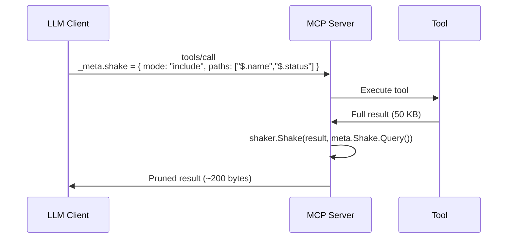

# 🤖 MCP Integration

Use tree-shaker to let [Model Context Protocol](https://modelcontextprotocol.io) (MCP) clients prune tool results before they're returned to the LLM. This is especially useful when tool outputs are large (logs, configurations, deployment manifests) and every token matters.

---

## Flow



---

## How It Works

The [MCP specification](https://modelcontextprotocol.io) uses JSON-RPC 2.0, where `params._meta` is an open map for arbitrary metadata. By convention, a client-server pair can agree to pass a shake query inside `_meta` for client-controlled field selection.

### MCP Request

```json
{
    "jsonrpc": "2.0",
    "id": 1,
    "method": "tools/call",
    "params": {
        "_meta": {
            "shake": {
                "mode": "include",
                "paths": ["$.name", "$.status"]
            }
        },
        "name": "get_deployment",
        "arguments": { "deployment_id": "deploy-abc" }
    }
}
```

---

## Example

```go
type CallToolParams struct {
    Meta      *Meta          `json:"_meta,omitempty"`
    Name      string         `json:"name"`
    Arguments map[string]any `json:"arguments,omitempty"`
}

type Meta struct {
    ProgressToken any                  `json:"progressToken,omitempty"`
    Shake         *shaker.ShakeRequest `json:"shake,omitempty"`
}

func handleToolCall(params CallToolParams) (json.RawMessage, error) {
    result, err := executeTool(params.Name, params.Arguments)
    if err != nil {
        return nil, err
    }

    if params.Meta != nil && params.Meta.Shake != nil {
        result, err = shaker.Shake(result, params.Meta.Shake.Query())
        if err != nil {
            return nil, err
        }
    }

    return result, nil
}
```

---

## Before / After

**Tool result (raw — 50 KB):**
```json
{
    "name": "prod-api",
    "status": "running",
    "internal_ip": "10.0.0.42",
    "config": { "replicas": 3, "memory": "2Gi", "secrets": ["DB_PASS"] },
    "logs": "... 50KB of log output ..."
}
```

**Returned to LLM (after shake — ~200 bytes):**
```json
{
    "name": "prod-api",
    "status": "running"
}
```

The LLM sees only the fields it asked for, saving context window space and reducing noise.

---

<p align="center">
  <a href="composition.md">Next: 🔗 Composition →</a>
</p>
