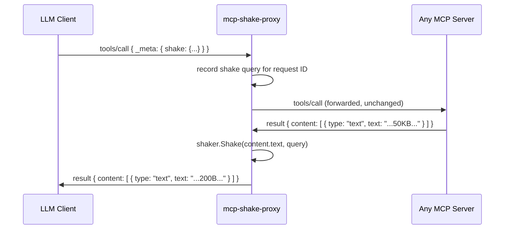

# 🔀 MCP Proxy

A thin stdio proxy that applies tree-shaker filtering to any MCP server — without touching the server itself.

---

## The Problem

The [MCP Integration](mcp-integration.md) example requires the server to implement shake support. But most MCP servers are third-party tools you don't control: filesystem, GitHub, Kubernetes, databases.

A proxy solves this: wrap any MCP server transparently, filter its responses before they reach the LLM.

---

## Flow



The proxy is invisible to both sides. The LLM client sends the standard MCP request with `_meta.shake`; the upstream server never sees it and returns unmodified data; the proxy applies filtering before forwarding the response.

---

## Implementation

The proxy intercepts JSON-RPC messages in both directions over stdio. It records shake queries on outgoing `tools/call` requests, then applies them when the matching response arrives.

```go
package main

import (
    "encoding/json"
    "io"
    "os"
    "os/exec"
    "sync"

    "github.com/mibar/tree-shaker/pkg/shaker"
)

type message struct {
    JSONRPC string          `json:"jsonrpc"`
    ID      any             `json:"id,omitempty"`
    Method  string          `json:"method,omitempty"`
    Params  json.RawMessage `json:"params,omitempty"`
    Result  json.RawMessage `json:"result,omitempty"`
    Error   json.RawMessage `json:"error,omitempty"`
}

type shakeProxy struct {
    pending sync.Map // request ID → *shaker.ShakeRequest
}

// interceptRequest records the shake query from an outgoing tools/call.
func (p *shakeProxy) interceptRequest(msg *message) {
    if msg.Method != "tools/call" || msg.ID == nil {
        return
    }
    var params struct {
        Meta *struct {
            Shake *shaker.ShakeRequest `json:"shake,omitempty"`
        } `json:"_meta,omitempty"`
    }
    if err := json.Unmarshal(msg.Params, &params); err != nil || params.Meta == nil || params.Meta.Shake == nil {
        return
    }
    p.pending.Store(msg.ID, params.Meta.Shake)
}

// interceptResponse applies the recorded shake query to a tools/call result.
func (p *shakeProxy) interceptResponse(msg *message) {
    if msg.Result == nil || msg.ID == nil {
        return
    }
    val, ok := p.pending.LoadAndDelete(msg.ID)
    if !ok {
        return
    }
    req := val.(*shaker.ShakeRequest)

    var result struct {
        Content []struct {
            Type string `json:"type"`
            Text string `json:"text,omitempty"`
        } `json:"content"`
        IsError bool `json:"isError,omitempty"`
    }
    if err := json.Unmarshal(msg.Result, &result); err != nil {
        return
    }

    for i, item := range result.Content {
        if item.Type != "text" || item.Text == "" {
            continue
        }
        filtered, err := shaker.Shake([]byte(item.Text), req.Query())
        if err != nil {
            continue // not JSON or invalid query — pass through unmodified
        }
        result.Content[i].Text = string(filtered)
    }

    raw, err := json.Marshal(result)
    if err == nil {
        msg.Result = raw
    }
}

func main() {
    // Usage: mcp-shake-proxy <server-command> [args...]
    // Example: mcp-shake-proxy npx @modelcontextprotocol/server-filesystem /docs
    cmd := exec.Command(os.Args[1], os.Args[2:]...)
    upstreamIn, _ := cmd.StdinPipe()
    upstreamOut, _ := cmd.StdoutPipe()
    cmd.Stderr = os.Stderr
    cmd.Start()

    proxy := &shakeProxy{}

    // client → upstream: forward requests, record shake queries
    go func() {
        dec := json.NewDecoder(os.Stdin)
        enc := json.NewEncoder(upstreamIn)
        for {
            var msg message
            if err := dec.Decode(&msg); err != nil {
                if err != io.EOF {
                    os.Stderr.WriteString(err.Error())
                }
                return
            }
            proxy.interceptRequest(&msg)
            enc.Encode(msg) //nolint:errcheck
        }
    }()

    // upstream → client: intercept responses, apply shake
    dec := json.NewDecoder(upstreamOut)
    enc := json.NewEncoder(os.Stdout)
    for {
        var msg message
        if err := dec.Decode(&msg); err != nil {
            return
        }
        proxy.interceptResponse(&msg)
        enc.Encode(msg) //nolint:errcheck
    }
}
```

---

## Usage

Build and register as a drop-in wrapper in your MCP client config:

```json
{
  "mcpServers": {
    "filesystem": {
      "command": "mcp-shake-proxy",
      "args": ["npx", "@modelcontextprotocol/server-filesystem", "/Users/me/docs"]
    }
  }
}
```

The LLM client then includes a shake query in any `tools/call` request:

```json
{
  "jsonrpc": "2.0",
  "id": 1,
  "method": "tools/call",
  "params": {
    "_meta": {
      "shake": { "mode": "include", "paths": ["$.name", "$.size", "$.modified"] }
    },
    "name": "list_directory",
    "arguments": { "path": "/Users/me/docs" }
  }
}
```

No changes to the filesystem server. No changes to the MCP client beyond including `_meta.shake`.

---

## Before / After

**Upstream server response (full):**
```json
{
  "name": "architecture.md",
  "path": "/Users/me/docs/architecture.md",
  "size": 4821,
  "modified": "2026-02-24T10:00:00Z",
  "permissions": "rw-r--r--",
  "inode": 8675309,
  "owner": "mibar",
  "group": "staff",
  "extended_attributes": {}
}
```

**LLM receives (after proxy shake):**
```json
{
  "name": "architecture.md",
  "size": 4821,
  "modified": "2026-02-24T10:00:00Z"
}
```

---

## Notes

**HTTP/SSE servers**: the same interception logic applies — wrap it in a reverse proxy that buffers `tools/call` responses, applies shake, and forwards. The `shakeProxy` struct is transport-agnostic; only the I/O layer changes.

**Query is opt-in**: requests without `_meta.shake` pass through unchanged. The proxy adds zero overhead for non-shake calls.

**Error passthrough**: if `content.text` is not valid JSON, the proxy forwards the original text unmodified. The LLM sees the full response rather than an error.

---

<p align="center">
  <a href="composition.md">Next: 🔗 Composition →</a>
</p>
