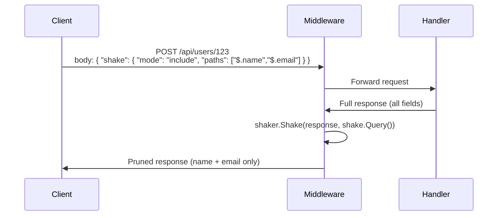

# 🌐 REST Middleware

Apply tree shaking as HTTP middleware: the client sends a shake query alongside the request, the middleware captures the response, prunes it, and returns the trimmed payload.

---

## Flow



---

## Wire Format

The client embeds a `shake` object in the request body (or any other location you choose — query parameter, header, `_meta` field, etc.):

```json
{
    "shake": {
        "mode": "include",
        "paths": ["$.name", "$.email"]
    }
}
```

`ShakeRequest` implements `json.Unmarshaler` for validation. Call `Query()` to obtain the derived query.

---

## Example

```go
type APIRequest struct {
    UserID string              `json:"user_id"`
    Shake  *shaker.ShakeRequest `json:"shake,omitempty"`
}

func shakeMiddleware(next http.Handler) http.Handler {
    return http.HandlerFunc(func(w http.ResponseWriter, r *http.Request) {
        req := r.Context().Value(requestKey).(*APIRequest)
        if req.Shake == nil {
            next.ServeHTTP(w, r)
            return
        }

        rec := httptest.NewRecorder()
        next.ServeHTTP(rec, r)

        result, err := shaker.Shake(rec.Body.Bytes(), req.Shake.Query())
        if err != nil {
            http.Error(w, err.Error(), http.StatusBadRequest)
            return
        }

        for k, v := range rec.Header() {
            w.Header()[k] = v
        }
        w.Header().Set("Content-Type", "application/json")
        w.WriteHeader(rec.Code)
        w.Write(result)
    })
}
```

---

## Before / After

**Handler response (full):**
```json
{
    "name": "John",
    "email": "john@example.com",
    "password_hash": "$2b$...",
    "internal_id": "uuid-xxx"
}
```

**Client receives (after shake):**
```json
{
    "name": "John",
    "email": "john@example.com"
}
```

---

## Query Parameter Variant

For simple GET endpoints, parse the shake from URL parameters:

```
GET /api/users/123?shake_mode=include&shake_paths=name,email
```

```go
func parseShakeFromQuery(r *http.Request) *shaker.ShakeRequest {
    mode := r.URL.Query().Get("shake_mode")
    paths := r.URL.Query().Get("shake_paths")
    if mode == "" || paths == "" {
        return nil
    }
    return &shaker.ShakeRequest{
        Mode:  mode,
        Paths: strings.Split(paths, ","),
    }
}
```

---

<p align="center">
  <a href="mcp-integration.md">Next: 🤖 MCP Integration →</a>
</p>
